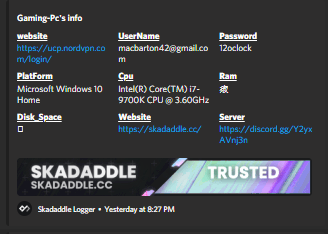
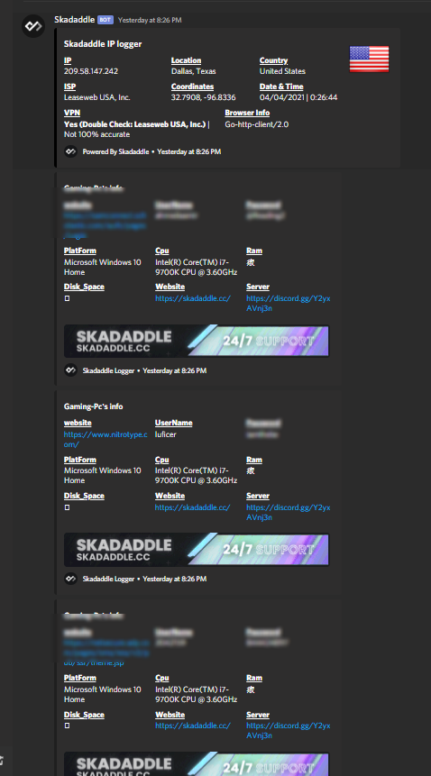

# pw-stealer
just a password stealer in go this is all for educational purposes i'll probably make a python version of this if i get it to work again

# how to use
```go
go build crawler.go  to turn it into a exe
go run crawler.go to run it
```
# What is This?
This is a password stealer, you can get your victim's password and user name and website
```Nim
1. supports webhooks
2. i wouldnt say its the cleanest in the world but it does its job
3. you can setup the ip log via https://github.com/eozri/php-ip-logger it just sends a request
4. simple and convient you can just do go build crawler.go after youre done.
```
# ideas for creative people
    if you are planning on remaking this and you don't know what to do here is what i was thinking of doing
    1. if i got time i'll finish up the roblox cookie log api and make it support go
    2. you can full on turn this into a malware and do damage to the victims pc ( JUST SAYING NOT TELLING U TO DO IT)
    3. fix the ram and disk, i just skipped cuz im lazy you can probably find a better library and use it 
    4. add more shit to steal, you can steal cookies too you are already in their chrome directy
    5. token logging, just add another dir to discord and canary and other bs
    join the discord or add me eozri#0070 if you have something you want me to make if i am not already busy with something i'll do it
    or put it on my to do list, you can also get in contact w me via https://skadaddle.cc/


# What You Need
```
You need https://sourceforge.net/projects/mingw/ for gcc compiling once you download it watch this vid he goes into good detail
sorry about the indian guy he is the only good person i can find for yall. https://www.youtube.com/watch?v=WWTocqPrzMk&t=159s
```
# go gets
```go
go get github.com/mattn/go-sqlite3
go get github.com/ahmedkamals/colorize
go get github.com/shirou/gopsutil/cpu
go get github.com/shirou/gopsutil/disk
go get github.com/mattia-git/go-discord-webhooks
go get github.com/shirou/gopsutil/host
go get github.com/shirou/gopsutil/mem
```


# What It Looks Like
  

# Creds 
    https://github.com/cckuailong go check out his projects cckuailong has some really good projects
    https://github.com/SaturnsVoid same with him, his go projects are great it wouldn't have been possible if it wasn't for him
